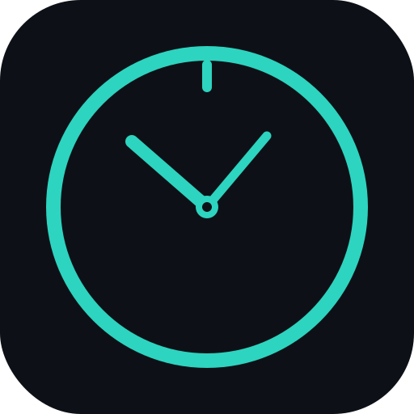

<div align="center">



# GHCountdown

**Countdown-first productivity. Local. Native. Fast.**

A native macOS desktop app built with Electron + React that keeps all your events, todos, time tracking, and planning data private — stored on-device, no cloud required.

[](https://electronjs.org)
[](https://react.dev)
[](https://www.typescriptlang.org)
[](LICENSE)

</div>

---

## Features

| Feature | Description |
|---|---|
| ⏳ **Countdown Hero** | Full-screen animated countdown to your next important event |
| 📅 **Events** | Create deadlines and milestones with priorities, tags, and notes |
| ✅ **Todos** | Inbox → Today workflow with project grouping |
| 🕐 **Timeline** | Visual hour-by-hour day planner with drag-and-drop blocks |
| 📆 **Weekly Calendar** | Week-at-a-glance view with recurring schedule presets |
| ⏱ **Time Tracking** | One-tap timer linked to any task, with daily/weekly totals |
| 📊 **Statistics** | Productivity charts and time breakdown |
| ✨ **AI Assistant** | Generates actionable summaries and can directly add todos, events, and timeline blocks |
| 🎨 **Themes** | Light, dark, and system-matched — persisted across launches |

---

## Getting started

### Requirements

- **macOS 12+** (primary target — arm64 & x64 builds)
- Node.js 20+
- npm 9+

### Install & run in dev mode

```bash
git clone https://github.com/N0v4ont0p/ghcountdown
cd ghcountdown
npm install

# Start the Vite dev server + Electron together
npm run dev            # Vite on http://localhost:5173
npm run electron:dev   # Open Electron pointing at the dev server
```

### Optional AI setup (Hugging Face)

```bash
cp .env.example .env
```

Then set your local key in `.env`:

```env
VITE_HUGGINGFACE_API_KEY=your_huggingface_api_key_here
VITE_HUGGINGFACE_MODEL=google/gemma-4-26b-it
```

> Keep `.env` local only. It is gitignored and should never be committed.

### Build the macOS app

```bash
# Build for both Intel and Apple Silicon
npm run electron:build:mac

# Build for Apple Silicon only (faster)
npm run electron:build:mac:arm64

# Build for Intel only
npm run electron:build:mac:x64
```

Artifacts land in `dist-electron/`:
- `GHCountdown-*.dmg` — drag-to-install disk image
- `GHCountdown-*-mac.zip` — zipped `.app` bundle

Open the `.dmg`, drag **GHCountdown** into **Applications**, and launch.

---

## Architecture

```
ghcountdown/
├── electron/
│   ├── main.cjs          # Electron main process (window, vibrancy, traffic lights)
│   └── preload.cjs       # Isolated preload (no Node APIs exposed to renderer)
├── src/
│   ├── App.tsx            # Root layout: sidebar + routed main panel
│   ├── components/
│   │   ├── Sidebar.tsx         # Navigation sidebar with drag region
│   │   ├── CountdownHero.tsx   # Animated countdown display
│   │   ├── EventsView.tsx      # Event CRUD
│   │   ├── TodosView.tsx       # Todos + projects
│   │   ├── TimelineView.tsx    # Day planner
│   │   ├── WeeklyCalendarView.tsx
│   │   ├── TimeTrackingView.tsx
│   │   └── StatisticsView.tsx
│   ├── db/
│   │   ├── core.ts         # IndexedDB init (PocketBase-like local store)
│   │   ├── schema.ts       # TypeScript types for all entities
│   │   ├── seed.ts         # Demo data on first launch
│   │   ├── export.ts       # JSON + CSV export/import
│   │   └── repositories/   # Per-entity CRUD helpers
│   ├── hooks/
│   │   └── use-theme.ts    # Light/dark/system — persisted in localStorage
│   └── assets/
│       └── logo.svg        # App icon (cyan clock)
└── build/
    └── icon.png            # 1024×1024 icon used by electron-builder → .icns
```

**Storage** — all data lives in the browser's **IndexedDB** inside the Electron renderer process. No SQLite, no external database, no network calls.

---

## Data & privacy

- Everything is stored in `IndexedDB` on the local machine only.
- No telemetry, no analytics, no accounts.
- **Export** a full JSON backup or individual CSVs at any time from Settings → Data Management.
- **Import** a JSON backup to restore or migrate data.

---

## macOS specifics

- `titleBarStyle: 'hiddenInset'` — traffic-light buttons inset into the sidebar drag region.
- `vibrancy: 'sidebar'` — frosted-glass sidebar that adapts to desktop wallpaper.
- `-webkit-app-region: drag` — the top strip of both the sidebar and main panel is a native drag handle.
- All scrollbars are hidden (`scrollbar-width: none`) for a clean, native feel.
- Theme preference persisted in `localStorage` across app restarts.

---

## License

[MIT](LICENSE)
